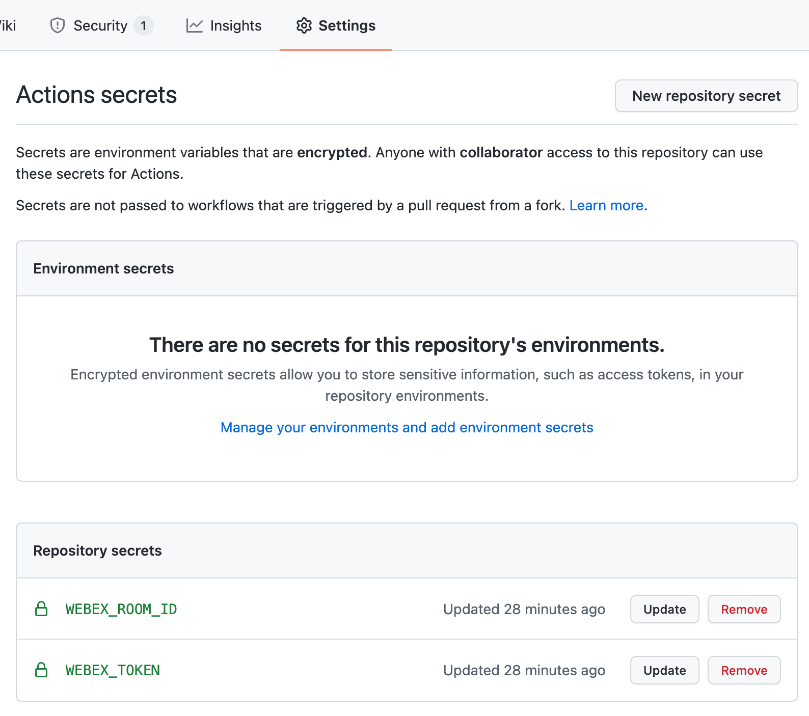

[](https://developer.cisco.com/codeexchange/github/repo/chrivand/action-webex-js)

# Webex: Post to Room GitHub Action

> **Note:** please test this well before using in production, this is a sample action!

This **GitHub Action** posts a message to a **Webex Room** using the **Webex API** and a **NodeJS GitHub Action**. 

## Usage

1. Set the Webex Room ID (`ROOM_ID`) and Webex Access Token (`WEBEX_TOKEN`) as repository secrets in the repository that you want to run the action in. Please find more information regarding Webex Bots in the [Webex developer documentation](https://developer.webex.com/docs/bots).



> **Note:** make sure that the Webex Bot is added to that space, otherwise this will fail.

2. Create a file called `webex_post_message.yml` with the following content in the `.github/workflows` directory of your repository from where you want to run the action:

```yml
name: Post Message to Webex Room JS Action

on: 
  push:

  # Allows you to run this workflow manually from the Actions tab
  workflow_dispatch:

jobs:
  webex_message:
    runs-on: ubuntu-latest
    name: Send a Webex Notification
    steps:
      - name: Post Message to Webex Room
        uses: chrivand/action-webex-js@main
        env:
          WEBEX_TOKEN: ${{ secrets.WEBEX_TOKEN }}
          WEBEX_ROOM_ID: ${{ secrets.WEBEX_ROOM_ID }}
          MARKDOWN_MESSAGE: '**Hello, world!**'
```          

3. Adjust the `yml` file as needed, especially the `MARKDOWN_MESSAGE` environment variable. You can for example trigger a Webex notification based on certain output of other actions that you have run before.
